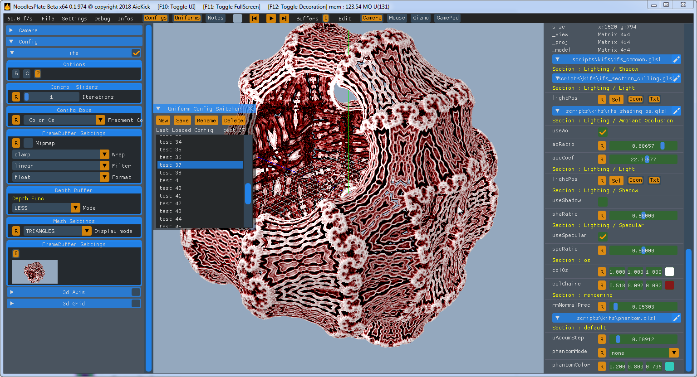

# NoodlesPlate

NoodlesPlate is a offline Shader Editor. 

His partuclarity is to offer to the user many type of widgets, let you easilty tuning in real time your shader.

all the system is designed for let the user choose his text editor. NoodlespLate update all ui after each code chnage (file save)

you can check the wiki if you want more infos

<ins>Smoe features availables :</ins>
* many uniforms widgets :
  * sliders
  * checkbox
  * combobox
  * radio buttons
  * time / date / deltatime
  * frame
  * gizmo (tranlate / rotate / scale) via [ImGuizmo](https://github.com/CedricGuillemet/ImGuizmo)
  * gamepad
  * mouse
* Vertex / Fragment / Geometry shader ibn one file
* in code config (selectable in ui)
* include files
* multipass
* compute shader
* immport of ShaderToy / GlslSandbox / VertexShaderArt
* multi attachments buffers
* uniforms config switcher
* Primitve Culling System via Gizmo
* sdf merge with mesh
* wold camera in your shaders
* fullscreen windowed or full
* trasnparant window (contorle with the alpha value of your shader)
* save picture for each code modification (let you create video of your shader design)
* pixel debugging, offer rgba value inspection
* inspect gpu metrics (temperature / load / memory / etc.. only support nvidia for the moment)

<ins>Features planned :</ins>
* Node Graph (wip, not stable)
* video / audio (playback / recording)
* timeline for uniforms tuning over time
* bvh player for uniforms
* vr support ( let you define the buffer on eye / and use sticks)

<ins>Some screenshots :</ins>

