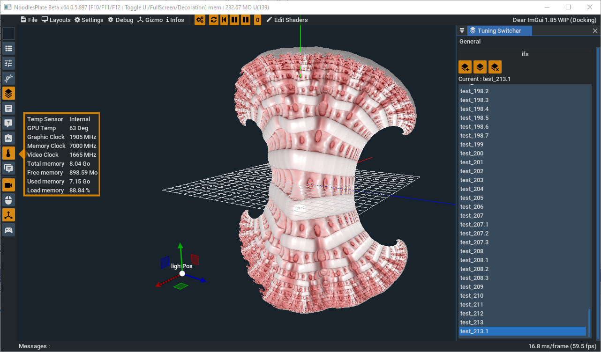
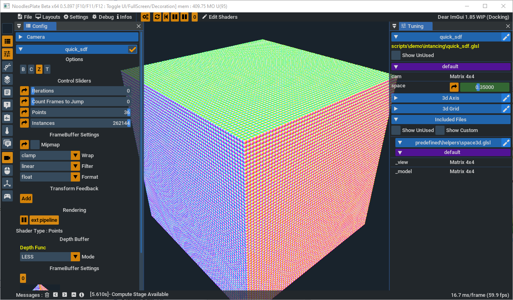
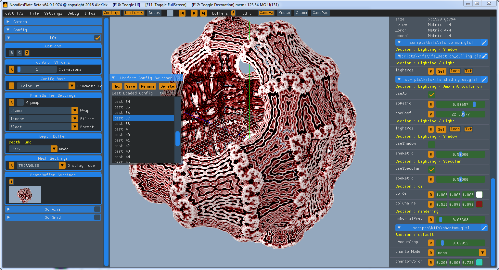
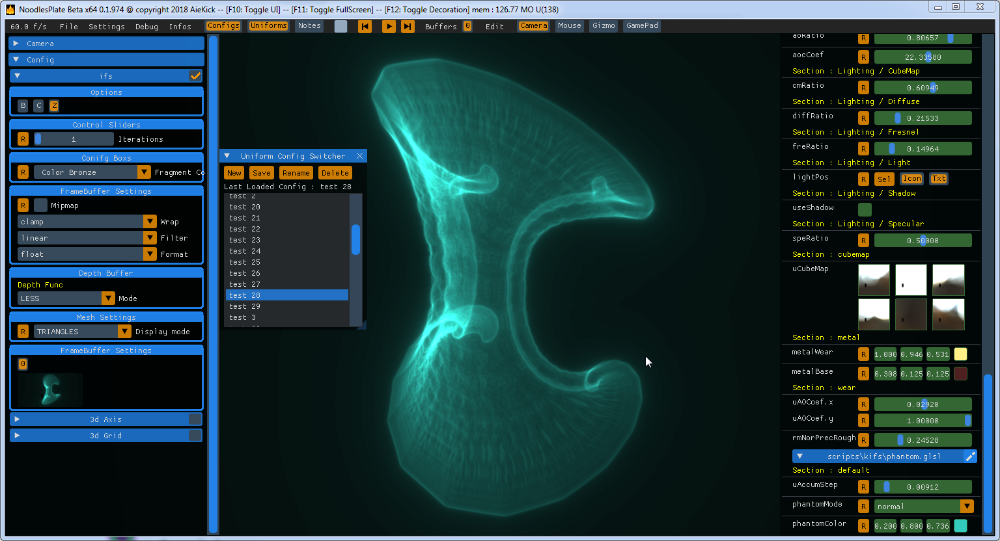

[](https://github.com/aiekick/NoodlesPlate/actions/workflows/Win.yml)
[](https://github.com/aiekick/NoodlesPlate/actions/workflows/Osx.yml)
[](https://github.com/aiekick/NoodlesPlate/actions/workflows/Linux.yml)
[](https://github.com/aiekick/NoodlesPlate/actions/workflows/gh-pages.yml)

# NoodlesPlate

NoodlesPlate is a offline Shader Editor. 

His particularity is to offer to the user many type of widgets, let you easilty tune in real time your shader.

all the system is designed for let the user choose his text editor. NoodlespLate update all ui after each code change (file save)

you can check the wiki if you want more infos

<ins>Some features availables :</ins>
* many uniforms widgets :
  * sliders
  * buttons
  * checkbox
  * combobox
  * radio buttons
  * time / date / deltatime
  * frame
  * gizmo (translate / rotate / scale) via [ImGuizmo](https://github.com/CedricGuillemet/ImGuizmo)
  * gamepad (go in settings dialog for tune and affect your gamepad buttons / sticks)
  * mouse
  * color picker
  * midi devices
* Time Line for easy animation crration (based on the behavior of blender3D)
  * export all frames in pictures
* uniforms collapsable / expandable by section or hidden (defined in code)
* Vertex / Fragment / Geometry / tesselation control / tesselation eval shaders => all in one file
* primitive instancing
* in code config (selectable in ui)
* include files
* multipass :
  * in many files
  * or in one file
* compute shader => not finalized, support only 2d/3d texture. no mesh generation
* import of ShaderToy / GlslSandbox / VertexShaderArt
  * import fo shadertoy now possible in one file only
* multi attachments buffers
* uniforms config switcher => lets you save/load uniforms conf file
* Primitve Culling System via Gizmo
* sdf merge with mesh
* wold camera (perspective / orthographic) in your shaders
* fullscreen windowed or full
* transparant window (controled with the alpha value of your shader)
* save picture for each code modification (let you create video of your shader design)
* pixel debugging, offer rgba value inspection (with mouse, under line on screen)
* inspect gpu metrics (temperature / load / memory / etc.. only support nvidia for the moment)
* gpu live profiler (flamegraph type)
* support of transform feedback for extrac mesh from vertex/geometry/tesselation stage
* Advanced UI system for extract panes to windows (thanks to Dear Imgui Docking/Viewport system)
* Advanced theming system (thanks to Dear Imgui)
* support of the VR (via OpenXR) :
  * a button in the left toolbar is available for enable/disable the vr 
  * display the left eye on the screen
  * support of controllers : 
    * Generic pads (tested => OK)
    * Occulus touch (tested => OK)
    * Valve index (not tested => but will work as expected i guess)
  * camera can be controlled via VR controllers, if the camera vr control is checked and only when swizzle (side trigger) is pressed :
    * left controller thumbstick x can be used for roll (axis z) the camera
    * left controller trigger can be used for move the camera backward
    * right controller trigger can be used for move the camera forward
    * right controller thumbstick up/down can be used for pitch (axis x) the camera
    * right controller thumbstick left/right can be used for yaw (axis y) the camera
  * the triggers, thumbsticks, and swizzle are available as uniforms. 
    swizzle can be used if the camera vr control is unchecked
    check the help avaialble in elft toolabr for have the unifomrs syntax
    
<ins>Features planned :</ins>
* Node Graph (wip, not stable)
* video / audio (playback / recording)
* bvh player for uniforms

Binaries => https://github.com/aiekick/NoodlesPlate/releases

Build tested and succeded on :
* On Win 7 x64 (in version x32/x64)
* On Win 10 x64 (in version x64)
* On Linux Debian/Ubuntu (in version x32/x64)
* On Linux Debian/RaspberryOs (in version x86/x64)
* MacOs Mojave (in version x86)

# requirements

* Cmake
* OpenSSH
* C++17

# how to build

## first : clone the repo and initialize their submodules

```cpp
git clone https://github.com/aiekick/NoodlesPlate.git
cd NoodlesPlate
git submodule update --init --recursive
```

## second : build with cmake

You need to use cMake.
For the 3 Os (Win, Linux, MacOs), the cMake usage is exactly the same, 

1) Choose a build directory. (called here my_build_directory for instance) and
2) Choose a Build Mode : "Release" / "MinSizeRel" / "RelWithDebInfo" / "Debug" (called here BuildMode for instance)
3) Run cMake in console : (the first for generate cmake build files, the second for build the binary)
```cpp
cmake -B my_build_directory -DCMAKE_BUILD_TYPE=BuildMode
cmake --build my_build_directory
```

## On Windows :

You need to have the opengl library installed

## On Linux :

You need many lib : (X11, xrandr, xinerama, xcursor, mesa)

If you are on debian you can run :  

```cpp
sudo apt-get update 
sudo apt-get install libssl-dev libgl1-mesa-dev libx11-dev libxi-dev libxrandr-dev libxinerama-dev libxcursor-dev libasound2-dev
```

## On MacOs :

you need many lib : opengl, openssl and cocoa framework

# License :

NoodlesPlate is an open source software under [GPL-3.0](LICENSE)

# Library used :

* [Glfw - ZLIB](http://www.glfw.org/)
* [Dear ImGui - Docking branch - MIT](https://github.com/ocornut/imgui)
* [Glad - MIT](https://github.com/Dav1dde/glad)
* [Stb - MIT](https://github.com/nothings/stb)
* [tinyxml2 - ZLIB]( https://github.com/leethomason/tinyxml2)
* [cTools - MIT](https://github.com/aiekick/cTools)
* [ImGuiFileDialog - MIT](https://github.com/aiekick/ImGuiFileDialog)
* [Curl - MIT](https://curl.haxx.se/")
* [ImGuizmo MIT](https://github.com/CedricGuillemet/ImGuizmo)
* [imgui_markdown MIT](https://github.com/juliettef/imgui_markdown)
* [AlphaNum MIT](http://www.davekoelle.com/alphanum.html)
			
# Some screenshots :

NoodlesPlate v0.6.660

VR Mode (show left eye in screen) with the shader [Dual 3D Truchet Tiles](https://www.shadertoy.com/view/4l2cD3) of [Shane](https://www.shadertoy.com/user/Shane)


NoodlesPlate v0.5.897






NoodlesPlate v0.1.3075



