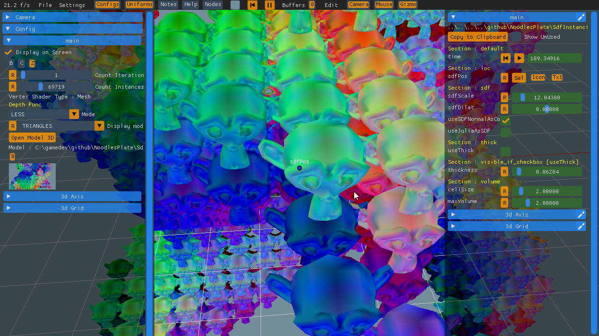
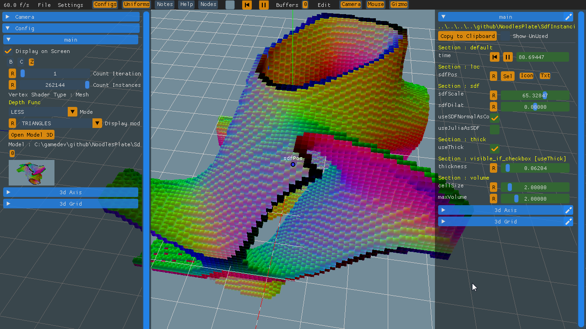

Test Case : Fluid Simu 2d

this shader is a fluid simulation
To be opened in NoodlesPlate

this shader demonstrate the different features :

 * tunable iterations count selectable via comboboxvia 
 * uniforms tuning
 * use of many fbo attachements
 * multipass
 
Some pictures of what i rely :

