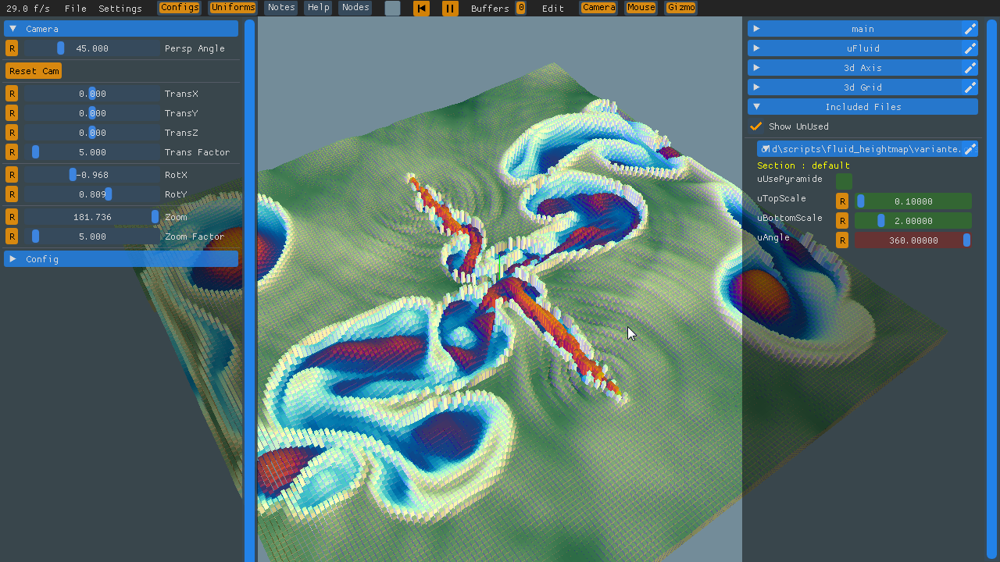
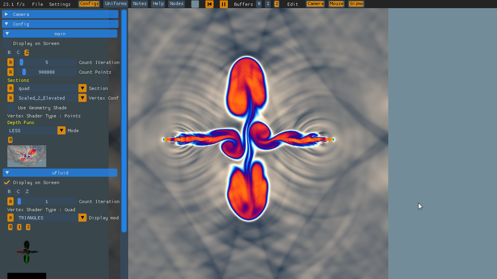
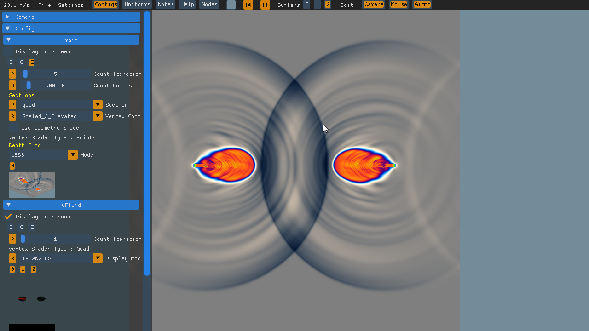
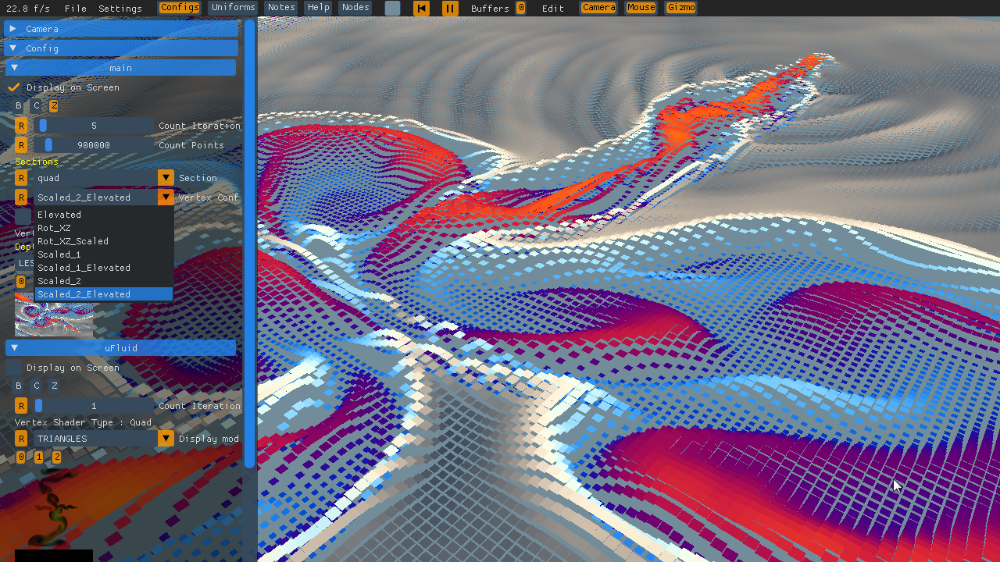
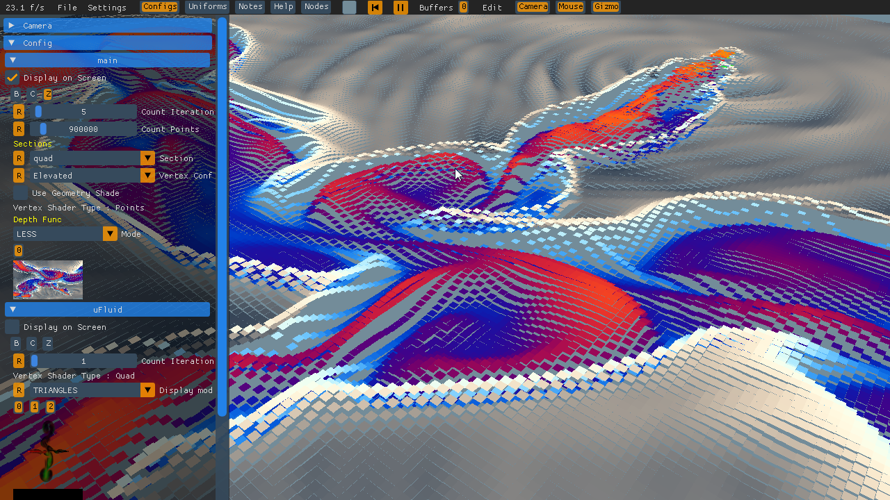
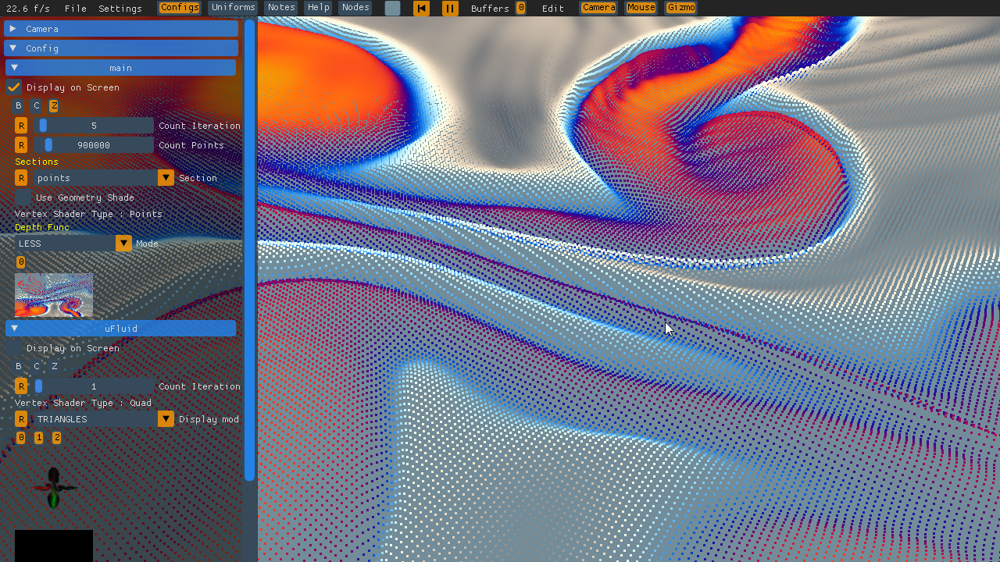

Test Case : Fluid Height Map

this shader is a fluid simulation dsiplayed via dynamic mesh's :)
To be opened in NoodlesPlate

this shader demonstrate the different features :

 * differents section names selectable via combobox
 * differents vertex primitive type selectable via combobox
 * different config in section code selectable via combobox
 * uniforms tuning
 * use of many fbo attachements
 * picture selection
 * multipass
 
Some pictures of what i rely :

