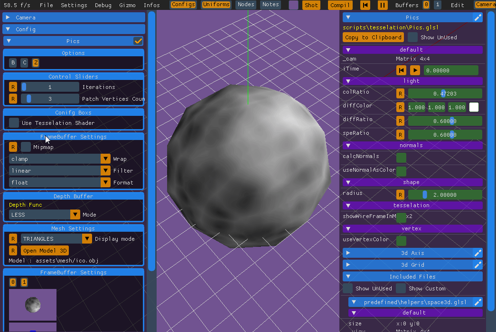

Test Case : Tesselation Shader (Control / Evaluation)

this shader is a demo for the tesselation shader support

To be opened in NoodlesPlate

need NoodlesPlate in version after 0.1.1100

this shader demonstrate the different features :

 * tesselation sahder definition in code (Control + Eval)
 * enable/disable tesselation
 * tune uniforms
 * enable / disable MSAA 2x just for seeing the wireframe of the tesselation
 (pay attention, the fbo feature, like tecture visu atatched to FBO or pixel debugging are not working during MSAA 2x enabled), i need a modif of the pipeline for support it. So for the moment, pay attention :)

if you want to choose another mesh by default see the @VERTEX seciton in code. you can alos load another in the config pane
 
Some pictures of what i rely :

Tesselation enable / disable + uniforms tuning

Msaa X2 for inspect wireframe ( see the breaked texture on left pane )

