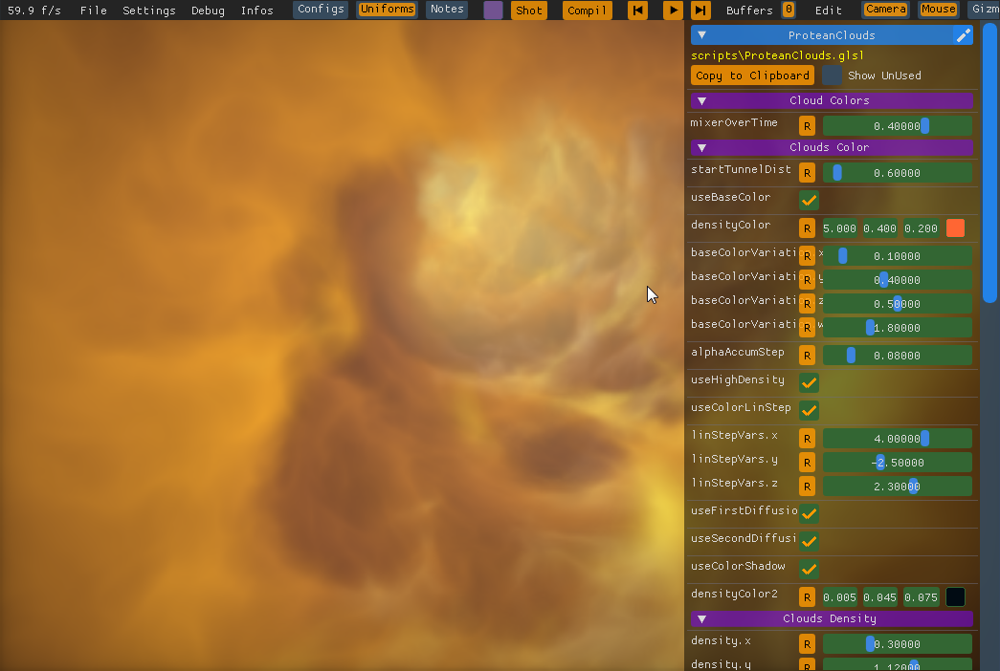

Protean Cloud 

this shader was created by nitmitz on ShaderToy

The shader on ShaderToy : https://www.shadertoy.com/view/3l23Rh
 
The url of Nitmitz : https://www.shadertoy.com/user/nimitz

I converted it for NoodlesPlate, commented a lot 
and configured it with many widgets for exploring the shader 

it is also a demo of what NoodlesPlate can do, 
see the many uniforms you have in the code

you have also a [video](video.mp4) of what this shader configured like
 taht can do in NoodlesPlate.

